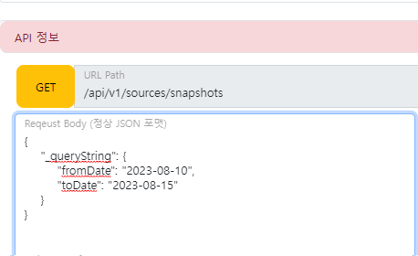
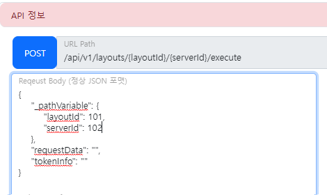
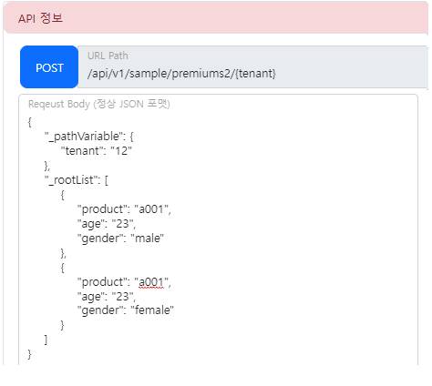

### API 테스트 Advanced
> API TEST 사용시에 조금 복잡한 내용에 대해서 정리합니다.  
> 일반적으로 상용 TOOL에서는 별도로 구분되지만 aTworks에서는 시나리오 연결을 위해 Rquest 데이터에 json 형태로 넣었습니다.

#### QUERY_STRING
> HTTP Method가 `GET`에서 주로 사용되는 형태지만 다른 Http Mehtod에서도 사용 가능하다  
> URL에 ? 뒤에 key=value 형태로 들어가는 데이터입니다. 




- `_queryString` 은 제거되고, ? 로 시작하고 각 데이터끼리 & 로 구분된다
- [결과] : /api/v1/source/snapshots?fromDate=2023-08-10&toDate=2023-08-15

#### PATH_VARIABLE
> URL PATH에 resource 데이터가 직접 입력되는 방식


 
- `_pathVariable` 은 제거되고, {} 내부에 있는 key와 맵핑되서 자동으로 치환된다
- [결과] : /api/v1/layouts/101/102/execute


#### ROOT_LIST
> JSON 형태에서 Object가 아닌 List 객체로 시작할 수 있는 경우입니다.   
> QUERY_STRING, PATH_VARIABLE가 Request 로 내려오는 바람에 ROOT_LIST도 별도의 예약어로 추출됩니다.




- [결과] : /api/v1/sample/premiums2/12
  ```
  [
    {
        "product": "a001",
        "age": "23",
        "gender": "male"
    },
    {
        "product": "a001",
        "age": "23",
        "gender": "female"
    }
]
  ```