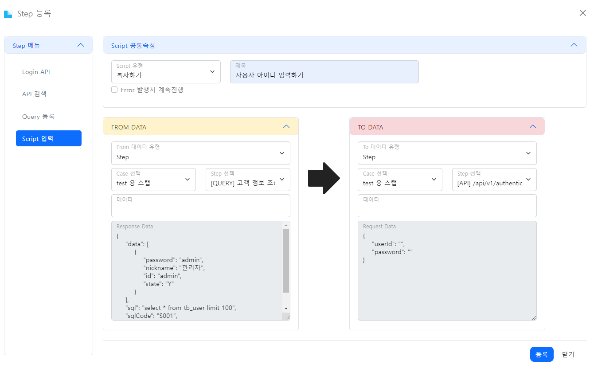
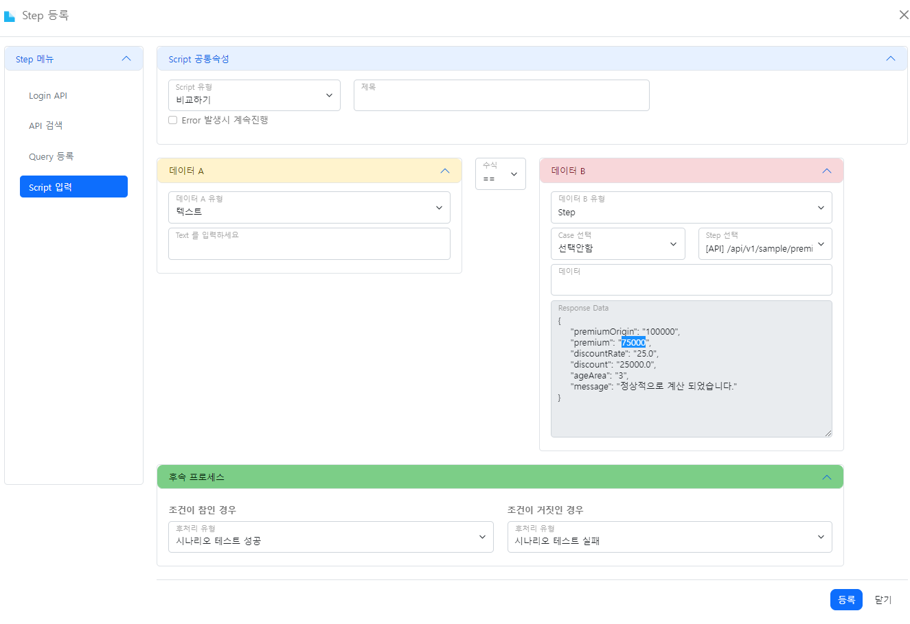
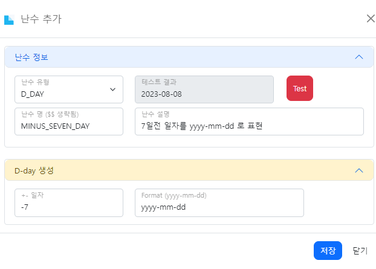
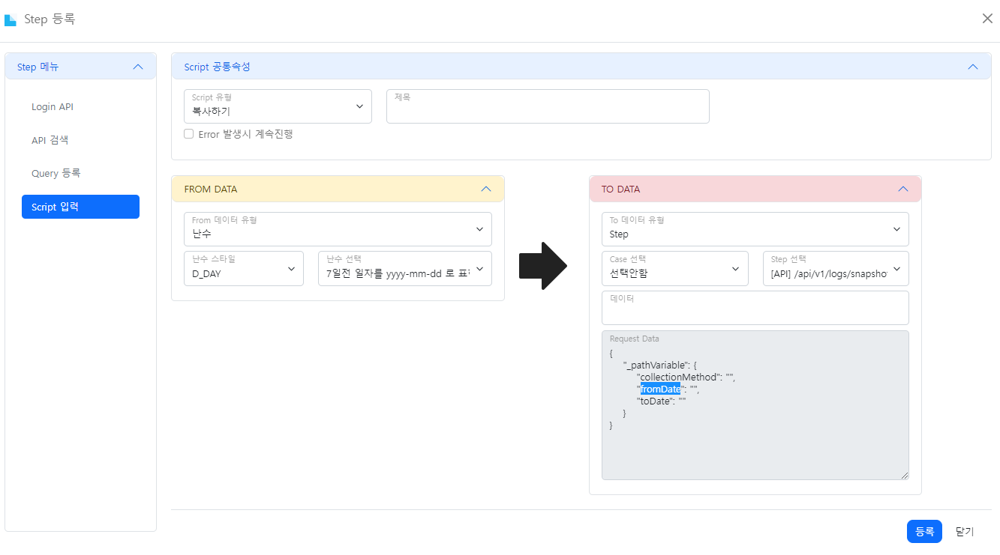
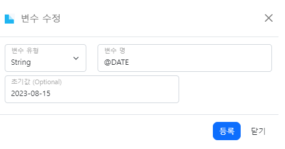
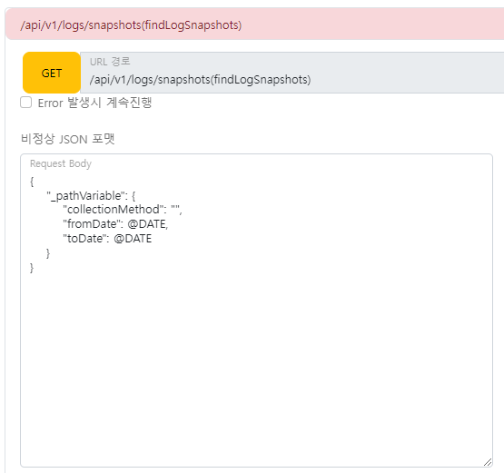
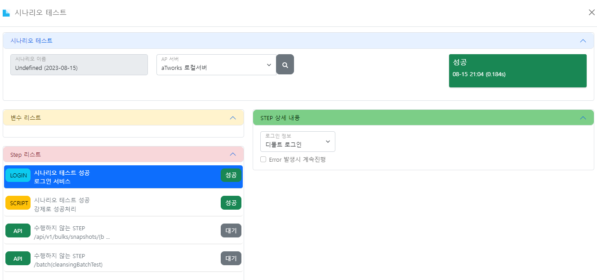
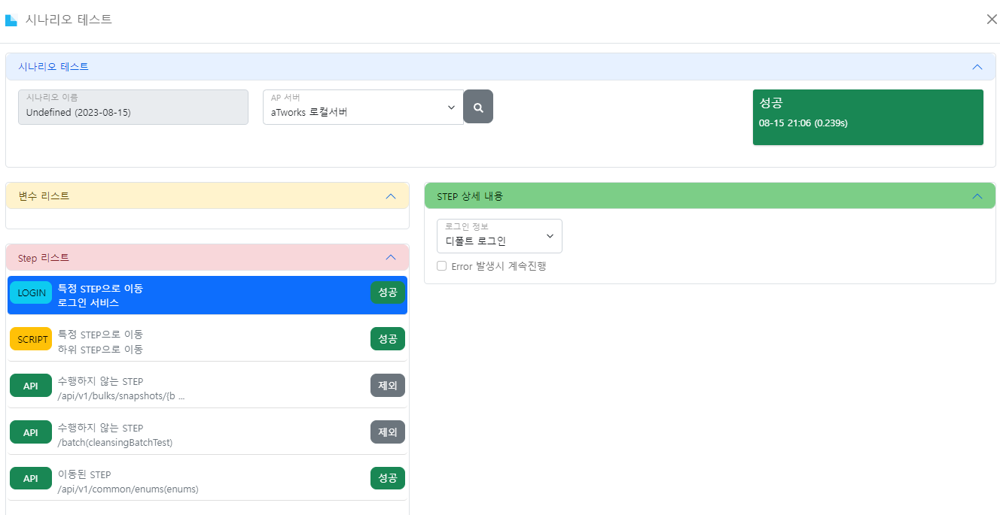

### Script 작성법 상세 설명
> 여기서는 Script 작성에 있어 더 상세한 설명에 대해 정의 합니다.

#### 1. Step에서 특정데이터 추출 문법
> aTworks에서는 복사하기의 To Item은 Request Data를 사용하고 From Item과 비교하기에서는 Response data를 사용하여 특정데이터를 추출하고 있습니다.
- 기본적으로 javaScript 에서 json 객체를 추출하는 방법으로 하위 데이터에 접근할 수 있는데 단 구분값마다 `.`는 반드시 들어간다

```text
aTworks script 작성 주요 문법

- OBJECT 하위로 내려가는 경우 `.` 으로 처리된다
- LIST 하위로 내려가는 경우 `.[1]` 으로 하면 리스트에 2번째 값에 접근한다
- 리스트 객체의 사이즈를 알고 싶은 경우 `.size()`로 처리한다
- `@변수명` 라는 변수를 입력하고 request에 동일하게 입력하게 되면 자동으로 치환되는 작업이 이뤄진다

```

#### 2. Advanced 예제
##### 2.1. 단순 복사하기
> 상위 Step의 resonse data를 하위 Step의 request data로 입력


 

- FROM DATA(SQL 수행) 조회된 데이터의 id('admin') 을 뽑아서 TO DATA(API 호출) userId로 넣는 작업을 진행하려고 한다.
``` javascript
- FROM DATA > 데이터 : data.[0].id
- TO DATA > 데이터 : userId 
```


##### 2.2. 단순 비교하기
> 특정 Step 의 Response data의 `premium` 의 값이 75000 이 아니면 오류로 가정한다


- 데이터 B에서는 reponse 데이터중에 premium의 데이터를 활용하고 데이터 A에서는 직접 입력하여 비교할 대상을 선택
``` javascript
- 데이터 A > 데이터 : 75000
- 데이터 B > 데이터 : premium 
```


##### 2.3. 난수 활용하기
> aTworks에서 제공하는 난수 생성을 통해 일주일전 일자를 yyyy-mm-dd 포맷으로 제공받아 Request data 의 `fromData` 에 입력한다


- 신규로 7일전의 데이터를 입력받는다


- Step 입력화면


``` javascript
- TO DATA > 데이터 : fromDate 
```


##### 2.4. 일괄 복사하기
> 여러 API에 대한 Request를 한번에 변경할 때 사용합니다.   
> 변수에 `@`로 시작하는 변수를 입력하면 Step이 수행되기 전에 일괄로 변수명의 대체한다





#### 3. 후속프로세스 정의 

- 시나리오 테스트 성공: 시나리오 테스트를 성공으로 처리하며, 후속 프로세스를 진행하지 않습니다.
  

- 시나리오 테스트 실패: 시나리오 테스트를 실패로 처리하며, 후속 프로세스를 진행하지 않습니다.
- 하위 Step으로 이동: 선택한 하위 Step으로 이동하며 사이에 있는 Step은 테스트 대상에서 제외합니다. 
  

- 선택안함: 아무런 행위를 하지 않으면 이후 Step으로 이동합니다.