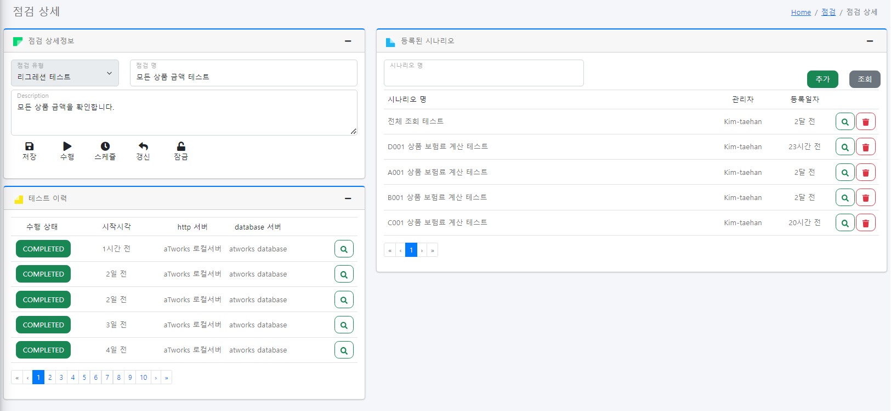
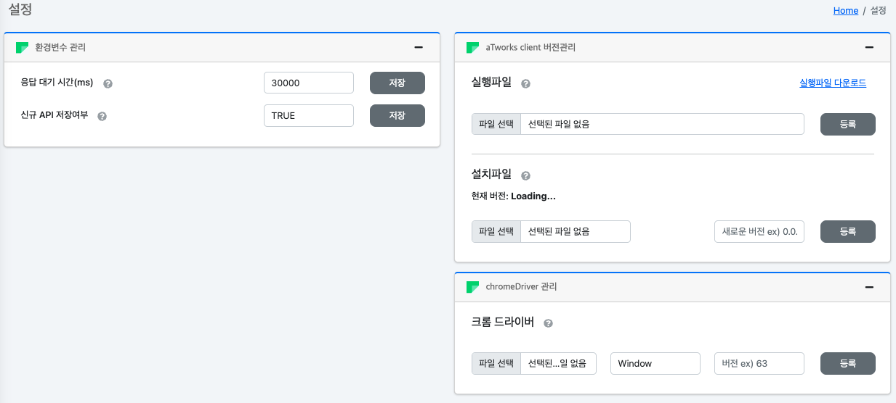

# aTworks <!-- omit in toc -->
aTworks 사용자 가이드 v1.0 

## Table of Contents <!-- omit in toc --> 
- [1. 공통 레이아웃](#1-공통-레이아웃)
  - [1.1 상단 메뉴](#11-상단-메뉴)
  - [1.2 좌측 메뉴](#12-좌측-메뉴)
- [2. 메인](#2-메인)
  - [2.1 특정일자 테스트 결과](#21-특정일자-테스트-결과)
  - [2.2 일자별 테스트 건수](#22-일자별-테스트-건수)
  - [2.3 서버별 테스트 성공률](#23-서버별-테스트-성공률)
- [3. 서버관리](#3-서버관리)
  - [3.1 서버 등록 및 수정 (팝업)](#31-서버-등록-및-수정-팝업)
    - [3.1.1 HTTP 서버 등록](#311-http-서버-등록)
    - [3.1.2 TCP 서버 등록](#312-tcp-서버-등록)
    - [3.1.3 UI 서버 등록](#313-ui-서버-등록)
    - [3.1.4 Database 서버 등록](#314-database-서버-등록)
  - [3.2 로그인정보 (팝업)](#32-로그인정보-팝업)
- [4. 난수](#4-난수)
  - [4.1 LIST 난수 등록/수정 (팝업)](#41-list-난수-등록수정-팝업)
  - [4.2 NUMBER 난수 등록/수정 (팝업)](#42-number-난수-등록수정-팝업)
  - [4.3 DATE 난수 등록/수정 (팝업)](#43-date-난수-등록수정-팝업)
  - [4.4 D\_DAY 난수 등록/수정 (팝업)](#44-d_day-난수-등록수정-팝업)
  - [4.5 SSN 난수 등록/수정 (팝업)](#45-ssn-난수-등록수정-팝업)
- [5. API 구조](#5-api-구조)
  - [5.1 API 상세](#51-api-상세)
  - [5.2 API 테스트 (팝업)](#52-api-테스트-팝업)
  - [5.3 듀얼 API 테스트 (팝업)](#53-듀얼-api-테스트-팝업)
  - [5.4 결과비교 (팝업)](#54-결과비교-팝업)
- [6. 대량 테스트](#6-대량-테스트)
  - [6.1 대량 테스트 등록](#61-대량-테스트-등록)
  - [6.2 대량 테스트 결과](#62-대량-테스트-결과)
    - [6.2.1 대량 테스트 API 결과 상세](#621-대량-테스트-api-결과-상세)
- [7. 시나리오](#7-시나리오)
  - [7.1 시나리오 잠금/해제 (팝업)](#71-시나리오-잠금해제-팝업)
  - [7.2 시나리오 수행](#72-시나리오-수행)
    - [7.2.1 시나리오 정보](#721-시나리오-정보)
    - [7.2.2 시나리오 상세정보](#722-시나리오-상세정보)
    - [7.2.3 Case 상세정보](#723-case-상세정보)
- [8. 점검](#8-점검)
  - [8.1 점검 등록 (팝업)](#81-점검-등록-팝업)
  - [8.2 점검 상세](#82-점검-상세)
  - [8.3 점검 수행 (팝업)](#83-점검-수행-팝업)
  - [8.4 스케줄 등록 (팝업)](#84-스케줄-등록-팝업)
  - [8.5 시나리오 추가 (팝업)](#85-시나리오-추가-팝업)
- [9. 스케줄러](#9-스케줄러)
  - [9.1 스케줄러 수정](#91-스케줄러-수정)
- [10. 발송이력](#10-발송이력)
- [11. 통계](#11-통계)
  - [11.1 API 통계](#111-api-통계)
    - [11.1.1 API 통계 상세정보](#1111-api-통계-상세정보)
  - [11.2 서버 통계](#112-서버-통계)
    - [11.2.1 서버 통계 상세정보](#1121-서버-통계-상세정보)
- [12. 소스분석](#12-소스분석)
  - [12.1 소스분석 상세](#121-소스분석-상세)
- [13. 로그데이터](#13-로그데이터)
  - [13.1 로그데이터 분석 요청](#131-로그데이터-분석-요청)
  - [13.2 로그데이터 상세](#132-로그데이터-상세)
- [14. 사용자관리](#14-사용자관리)
  - [14.1 신규사용자 생성](#141-신규사용자-생성)
  - [14.2 기존사용자 수정](#142-기존사용자-수정)
- [15. 설정](#15-설정)
  - [15.1 환경변수 관리](#151-환경변수-관리)
  - [15.2 aTworks Client 버전관리](#152-atworks-client-버전관리)
  - [15.3 chrome Driver 관리](#153-chrome-driver-관리)

## 1. 공통 레이아웃

### 1.1 상단 메뉴
> 화면 상단에 위치하고 있으며 모든 화면에서 공통으로 사용하는 메뉴입니다.  


- Home 메뉴: 메인화면으로 이동합니다
- 국기아이콘: 국제화(i18n) 기능을 제공합니다. 언어 선택 가능 (현재 한국어,영어 지원)
- 사용자정보: 로그인한 정보(역할,아이디) 확인 및 로그아웃 기능을 제공 합니다

### 1.2 좌측 메뉴
> 화면 좌측에 위치한 메뉴로 각 메뉴를 선택하게 되면 해당 메뉴로 이동합니다.
 
<div style="display:inline-block;vertical-align:top;">
    
</div>
<div style="display:inline-block; font-size:14px; padding-left:50px" >
    <p>1.메인</p>
    <p>2.서버관리</p>
    <p>3.난수</p>
    <p>4.API 구조</p>
    <p>5.대량테스트</p>
    <p>6.시나리오</p>
    <p>7.점검</p>
    <p>8.스케줄러</p>
    <p>9.발송이력</p>
    <p>10.통계</p>
    <p>11.소스분석</p>
    <p>12.로그데이터</p>
    <p>13.사용자관리</p>
    <p>14.설정</p>
</div>

## 2. 메인
> 로그인 후 초기화면으로 특정일자에 대한 **테스트 수행결과를 수치 또는 그래프**로 보여 줍니다.


### 2.1 특정일자 테스트 결과 
> 선택한 일자의 테스트수행 **총 건수, 성공건, 실패건, 성공률을** 보여줍니다. 


- 일자 변경: :date: 버튼을 클릭하여 테스트 결과를 확인하고 싶은 일자를 선택할 수 있습니다 
- 테스트 총 건수: 선택한 일자의 테스트 총 건수를 나타냅니다
- 테스트 성공건: 선택한 일자의 테스트 성공건수를 나타냅니다
- 테스트 실패건: 선택한 일자의 테스트 실패건수를 나타냅니다
- 테스트 성공률: 선택한 일자의 테스트 성공률을 나타냅니다

### 2.2 일자별 테스트 건수
> 등록된 서버별 최근 7일간(주말제외)의 테스트 건수를 보여줍니다.


- X축: 당일로 부터 주말을 제외한 최근 7일간 데이터를 보여줍니다
- Y축: 테스트 건수
- 범례: 등록된 서버(HTTP 또는 TCP 유형만) 

### 2.3 서버별 테스트 성공률
> 선택한 서버의 최근 7일간(주말제외)의 테스트 성공률을 보여줍니다.


- X축: 당일로 부터 주말을 제외한 최근 7일간 데이터를 보여줍니다
- Y축: 테스트 성공률
- 범례: 성공(녹색), 실패(적색)

## 3. 서버관리
> http, tcp, ui, database 등의 서버정보를 **등록 및 수정** 할 수 있습니다.
> 서버관리 메뉴의 경우 주의가 필요하므로 **관리자 권한을 가진 사용자만 접근 가능**합니다.

 
- 등록: `+신규` 버튼을 클릭 한다
- 수정: 서버 리스트의 🔍 버튼 또는 리스트 행을 더블 클릭 한다
- 로그인정보: 우측 사람(:cop:) 버튼을 클릭 한다
### 3.1 서버 등록 및 수정 (팝업)
> aTworks에서 지원하는 서버유형은 총 4가지(HTTP,TCP,UI,Database)이며 각 서버 유형별로 등록 필요 정보가 다릅니다.

유형|필수정보|설명
:--:|--|--
Server|URL,Content-Type,로그인 방식|http 네트워크 통신을 수행할 서버
TCP|IP,Port,전송구조|TCP 통신을 수행하는 서버
UI |URL,API 서버|시나리오 테스트에서 화면녹화 대상 서버
Database|jdbc URL, Database Type, ID, Password |시나리오 테스트에서 사용하는 Database 정보


#### 3.1.1 HTTP 서버 등록 

- 서버유형: Http(s)로 선택한다
- 배포환경: 테스트/운영 중 선택한다
- 서버이름: 테스터가 인지 가능한 서버이름을 입력한다
- URL: 호출할 서버 URL을 입력한다. Context ROOT만 입력 한다 
- 데이터 구조: Json, Xml, Form 형태를 선택한다
- 로그인방식
  1. None: 필요한 고정 Header 정보를 `JSON` 타입으로 입력한다
    예시
      ```json
      {
          "Authorization": "인증키값"
      }
      ```
  2. SessionId: 로그인 전문 API에 사용하는 Key 값을 입력한다 
  3. Customizing: 로그인 전문 API가 존재하며, 별도 로그인 정보 셋팅이 필요할 경우 사용  
     **aTworks 담당자 별도 협의필요**

#### 3.1.2 TCP 서버 등록

- 서버유형: TCP로 선택한다
- 배포환경: 테스트/운영 중 선택한다
- 서버이름: 테스터가 인지 가능한 서버이름을 입력한다
- IP: 호출한 TCP 서버 아이피를 입력한다
- Port: TCP 서버 포트를 입력한다
- 데이터구조: JSON, XML, **Fixed-Length**, Form 형태중 선택한다 

#### 3.1.3 UI 서버 등록

- 서버유형: UI로 선택한다
- 배포환경: 테스트/운영 중 선택한다
- 서버이름: 테스터가 인지 가능한 서버이름을 입력한다
- URL(Web): 시나리오에서 `화면 녹화를 수행할 URL`을 입력한다  
  _반드시, http(s)로 시작하는 URL을 입력한다_ 
- Database: API 서버를 선택한다 (녹화이력에서 수집한 전문을 수행할 서버 선택)
<!--데이터베이스가 아닌 API 호출 서버라고 해야하지 않을까 -->

#### 3.1.4 Database 서버 등록

- 서버유형: Database로 선택한다
- 배포환경: 테스트/운영 중 선택한다
- 서버이름: 테스터가 인지 가능한 서버이름을 입력한다
- JDBC Url: 반드시 **JDBC URL**을 입력한다
  예시
  `jdbc:postgresql://localhost:5432/atworks`
- Database: DBMS 유형을 선택한다 (Oracle, Postgres, MySql, H2 등)
- 접속ID: Database 접속 아이디 입력
- 패스워드: Database 접속 아이디의 비밀번호 입력
- Test 버튼: 입력한 정보로 Database 연결을 시도한다  
  `연결이 실패된 경우 DB 서버 등록이 불가하다`  
  _따라서, aTworks 서비스가 올라간 환경에서 입력한 **Database 접근이 가능**해야 한다_

### 3.2 로그인정보 (팝업)
> 로그인 레이아웃(전문)이 있는 경우 사용된다 (로그인방식이 session,customizing 일 경우 사용)


- ID/Password/설명 : 로그인 전문에서 사용되는 아이디/패스워드를 입력한다
- 등록: 입력한 정보가 최오일 경우 `Default` 값으로 지정된다
- 디폴트 로그인정보 선택: 둘 이상의 로그인정보가 존재할 경우 체크박스:white_check_mark: 버튼 또는 행을 더블클릭하여 디폴트 로그인 정보를 지정한다

- 삭제: 휴지통(🗑️) 버튼을 클릭한다 

## 4. 난수
> 사용자가 정의한 규칙으로 임의이 랜덤 데이터를 추출하여, 테스트에 활용됩니다.


- 난수 스타일

  유형|설명|기타
  :--:|--|--
  LIST|지정한 리스트에서 임의의 값 추출| 리턴 타입은 String 또는 Number 
  NUMBER|지정한 최소, 최대숫자 사이의 임의의 숫자 추출|
  DATE|지정한 일자 범위에서 임의의 날짜 추출| 날짜 포맷 지정가능 (yyyy-mm-dd 등)
  D_DAY|금일 기준으로 지정한 일수를 +- 한 일자| 날짜 포맷 지정가능 (yyyy-mm-dd 등)
  SSN|지정한 최소,최대 연령 사이의 국내 주민등록번호| 포맷 지정가능 

- 등록: `+신규` 버튼을 클릭하여 새로운 난수를 등록한다 (4.1~4.4 참조)
- 난수 상세조회: 목록의 행에서 돋보기(🔍)을 클릭한다
- 난수 삭제: 목록의 행에서 휴지통(🗑️)을 클릭한다 

### 4.1 LIST 난수 등록/수정 (팝업)
> 입력한 **리스트** 중의 임의의 값을 추출 합니다.


- 난수 명 및 설명: 테스터가 인지 가능한 난수명 또는 설명을 입력한다
- `Test`버튼: 입력한 정보로 추출된 난수를 확인한다
- 구분기호: List를 구분할 수 있는 기호(, / - : )를 선택한다  
- 결과타입: String 또는 Number 중 하나의 데이터 타입을 선택한다


### 4.2 NUMBER 난수 등록/수정 (팝업)
> 입력한 최소,최대 값 사이의 임의의 숫자를 추출 합니다.


- 난수 명 및 설명: 테스터가 인지 가능한 난수명 또는 설명을 입력한다
- `Test`버튼: 입력한 정보로 추출된 난수를 확인한다
- 최저/최고 값: 임의의 숫자가 추출될 범위를 정의한다

### 4.3 DATE 난수 등록/수정 (팝업)
> 입력한 From~To 일자 사이의 임의의 일자를 추출 합니다. (포맷지정가능)


- 난수 명 및 설명: 테스터가 인지 가능한 난수명 또는 설명을 입력한다
- `Test`버튼: 입력한 정보로 추출된 난수를 확인한다
- 시작일자,종료일자: 임의의 날짜가 추출될 범위를 정의한다
- Format: 날짜 형식 포맷을 정의한다

### 4.4 D_DAY 난수 등록/수정 (팝업)
> 입력한 일수(+또는-)를 현재일자에 합산할 일자를 반환 합니다. (포맷지정가능)


- 난수 명 및 설명: 테스터가 인지 가능한 난수명 또는 설명을 입력한다
- `Test`버튼: 입력한 정보로 추출된 난수를 확인한다
- +- 일자: 현재일자에 합산할 일자를 입력한다
- Format: 날짜 형식 포맷을 정의한다

### 4.5 SSN 난수 등록/수정 (팝업)
> 입력한 최소 및 최대 나이 사이의 임의의 주민등록번호를 추출 합니다.


- 난수 명 및 설명: 테스터가 인지 가능한 난수명 또는 설명을 입력한다
- `Test`버튼: 입력한 정보로 추출된 난수를 확인한다
- 최소/최대 나이: 추출될 임의의 주민등록번호 나이 범위를 입력한다
- Format: 주민번호 앞자리(A), 뒷자리(B)  
  예시
    1. AAAAAA: 주민등록번호 앞자리만 필요할 경우
    2. AAAAAA-*BBBBBB: 뒷자리 첫번째자리만 별표 표기  
    3. 입력하지 않을 경우 가상의 주민등록번호

## 5. API 구조
> 시스템에서 호출 가능한 API 목록을 조회할 수 있습니다.


- 검색조건: 조건을 입력하여 조건에 맞는 대량테스트 이력을 조회할 수 있다
  - API명: URL Path, Service ID, Service Desc Like 검색
  - Http Method
  - 업무구분: API 상위 업무 코드를 나타낸다
  - API 유형: API 유형을 나타낸다    
    (정상적인: 일반 API, 오래걸리는: Long Transaction API, 로그인: Login API)
  - `+신규`버튼: 신규 API 등록 팝업을 호출한다   
    (사이트별로 구조에 따라 정상적으로 등록되지 않을 수 있다)
- API 리스트 
  - URL Path: API의 URL Path를 표기한다
  - Http Method: Http Method Type을 나타낸다 (Post, Get, Put, Delete, Fetch)
  - 업무구분
  - Service ID
  - Service Desc
  - 수집경로: API 구조를 수집한 경로를 나타낸다
    - 직접 입력: 사용자가 수동으로 입력하는 경우
    - Source 분석: Controller, Dto 소스를 통해 API 구조를 생성
    - Log 분석: 미등록 API의 로그를 수집하는 경우
    - aTworks 테스트: 미등록 API를 화면 녹화를 통해 수집하는 경우
  - API 유형
  - 마지막 수정: 마지막으로 변경된 일자를 표기한다
  - API상세 조회: 🔍 버튼클릭 시 선택한 API 상세 결과화면으로 이동한다
  - API 삭제: 선택한 API 정보를 삭제한다  

### 5.1 API 상세
> 선택한 API의 URL정보, 서비스 정보, API Request, Response 정보를 보여 줍니다.


- URL 정보: 
  - URL Path, Http Method 정보를 보여준다
  - `수행`버튼: API 테스트 팝업을 오픈한다
  - `이력`버튼: `발송이력` 화면으로 가서 선택한 API 호출 이력을 보여준다
- 서비스 정보
  - Service ID (사이트마다 Service ID 기준은 상이함)
  - Service 설명
  - API 유형: API 특성을 보여준다
  - `저장` 선택한 API의 서비스 정보를 변경한다
- API Request/Response 정보
  - Request 정보, Response 정보: 
    - in/out: request, response 구분
    - 유형: 
  
    | 이름| 설명| 자식노드 소유여부| Response 적용|
    | --| --| --| --|
    | String| String Type data| X| O|
    | Number| Number Type Data| X| O|
    | Boolean| Boolean Type Data| X| o|
    | `List<T>`| List 내부에 String, Number, Boolean 데이터 존재| X| O|
    | _QueryString| URL에 '?' 뒤에 들어가는 Get 전용 데이터| O| X|
    | _PathVariable| URL Path에 직접적으로 들어가는 데이터| O| X|
    | _RootList| 최상위 객체가 List인 데이터| O| O|
    - 물리명: API 호출시 사용되는 Key
    - 논리명: 물리명에 대한 설명
    - Size: Fixed Length 방식에서만 사용되는 데이터
    - `+`버튼: 신규 컬럼을 추가 
    - `-`버튼: 기존 컬럼을 제거 

### 5.2 API 테스트 (팝업)
> 선택한 API를 사전에 등록된 Server에 호출 테스트를 수행할 수 있습니다. 


- 서버 정보: API 테스트 수행할 서버의 정보
  - 대상서버: 사전에 등록한 서버들 중에 선택할 수 있다
  - Server Url: 선택한 서버의 URL 정보
- API 정보
  - URL Path, Http Method 정보를 보여준다
  - 우측 상단에 API 테스트 결과를 보여준다   
    (사전에 협의되는 경우 사이트의 시스템 코드로 보여준다)
  - Request Body: 직접 입력하여 변경 가능
  - Reponse Body: 수정 불가
  - `Sample Data`버튼: 이전에 로그기록이나 테스트한 건중에 하나의 샘플 Request 를 조회
  - `전송`버튼: API Test를 수행한다
  - `듀얼 테스트`버튼: API 테스트 창을 더 오픈한다

### 5.3 듀얼 API 테스트 (팝업)
> API 테스트 창을 분할하여 하나의 API를 2개의 서버 또는 다른 데이터로 테스트를 수행합니다. 


  - `싱글 테스트`버튼: API 테스트로 돌아간다
  - `결과비교`버튼: 양쪽은 Response Data를 비교한다


### 5.4 결과비교 (팝업)
> 듀얼 테스트 Response Data를 비교하는 기능으로 aTworks 자체의 [직렬화](https://github.com/team-atworks/manual/blob/main/business/dataSerialization.md)를 통해 response의 Depth나 구조가 달라도 비교가 가능합니다.


- 컬럼명: String, Number, Boolean 단위의 Object의 Key를 보여준다
  (List의 경우 index를 포함한 prefix가 붙을 수 있다)
- Difference 유형: VALUE, TYPE, IS_NULL 등으로 분류된다 
- Server A: 왼쪽 API 테스트 결과
- Server B: 오른쪽 API 테스트 결과


## 6. 대량 테스트 
> 테스트 이력 또는 로그 기반으로 수행한 대량 테스트 수행 정보를 보여 줍니다.


- 검색조건: 조건을 입력하여 조건에 맞는 대량테스트 이력을 조회할 수 있다
- 테스트리스트
  - 수행상태: 대량테스트의 상태를 나타낸다 (STARTED, COMPLETED) 
  - 테스트명: 
  - 기초데이터: 대량테스트 데이터 근원을 나타낸다  
    (ATWORKS: 솔루션에서 수행한 테스트 이력, LOG: 로그 데이터 파일)
  - 테스트방법: 대량테스트 생성시 선택한 방법(SINGLE 또는 DUAL)이 표기된다
  - 수행건수: 대량테스트 총 테스트 수행 건수가 표기한다
  - 시작시각: 대량테스트 시작시각을 표기한다
  - ~~일시중지: 대량테스트 중단이 필요할 경우 클릭한다~~ 
  - 대량테스트상세 조회: 🔍 버튼클릭 시 선택한 대량 테스트의 상세 결과화면으로 이동한다
  - 대량테스트 삭제: 선택한 대량 테스트 정보를 삭제한다   

### 6.1 대량 테스트 등록 
> 대량 테스트는 테스트이력 또는 로그데이터 기반으로 수행할 수 있습니다.

- 등록 경로
  1. 발송이력 메뉴 우측상단
  2. 로그데이터 상세 우측상단
    

- 테스트 유형: Single Test 또는 Dual Test 중 선택한다  
  Dual Test 선택시 서버 2개를 선택해야 하며 **데이터 값 검증이 필요할 경우 체크** 한다  
  
- 수행방법: 실시간 수행 또는 예약 수행을 선택한다  
  예약수행 선택시 예약시간을 정한다  
  

### 6.2 대량 테스트 결과
> 대량 테스트의 상세 결과 및 수행된 API를 확인합니다.


- 엑셀 다운로드: 요약된 데이터를 엑셀 다운로드 합니다 
- 대량 테스트 정보: 테스트명, 건수, 상태, 완료시간 및 소요시간을 확인합니다
- 테스트 결과 리스트: 대량테스트에서 수행한 각 API 테스트 결과를 확인합니다
- API 상세정보 조회: 목록에 조회된 행의 더블클릭 또는 🔍 버튼을 클릭시 API 상세 정보 팝업이 호출된다

#### 6.2.1 대량 테스트 API 결과 상세
> 대량 테스트에서 수행된 한 API 상세 정보를 확인합니다. 호출한 당시의 요청 데이터 및 응답 데이터 확인이 가능합니다. 듀얼 테스트로 진행한 경우 **두결과값을 비교하는 기능**을 제공 합니다.


- 요청 및 응답데이터 확인: 호출된 시점의 요청 및 응답 데이터를 확인한다
- 테스트 수행: `전송` 버튼 클릭시 해당 화면에서 현시점으로 테스트 할 수 있다
- 결과비교: 듀얼테스트로 진행한 경우 두서버의 응답값을 비교할 수 있다  
    

## 7. 시나리오
> API 호출, SQL 조회등의 Transaction 단위를 연결하여 순차적으로 테스트를 수행  
> 시나리오 > 케이스 > 스텝으로 구성되어 있다


- 등록: `+신규` 버튼을 클릭 한다
- 수정: 서버 리스트의 🔍 버튼 또는 리스트 행을 더블 클릭 한다
- 잠금/잠금해제: 우측 잠금(:lock:) 버튼을 클릭 한다
  
### 7.1 시나리오 잠금/해제 (팝업)
> 시나리오가 잠금 상태인 경우 수정을 할 수 없다


- 비밀번호: 잠금을 해제할 때 입력할 비밀번호를 입력한다
- `잠금`버튼: 시나리오를 잠금 요청을 시도한다 
- `잠금 해제`버튼: 시나리오를 잠금 해제 요청을 시도한다 (시나리오가 잠긴 상태에서만 확인)

### 7.2 시나리오 수행
> 신규/기존 시나리오를 수정하거나 테스트 수행할 수 있다


#### 7.2.1 시나리오 정보
> 시나리오를 저장, 수행, 녹화, 스케줄 등록의 기능을 제공한다


- 시나리오 이름: 시나리오 이름을 확인하고 변경할 수 있다
- 관리자: 시나리오 관리자를 확인한다
- `저장`버튼: 변경된 시나리오 정보를 저장한다
- `수행`버튼: 시나리오 수행할 팝업을 오픈한다
- `열기`버튼: aTworks client 프로그램과 연동하는 팝업을 오픈한다
- `녹화`버튼: aTworks client 화면 녹화를 시작한다 (`정지` 버튼으로 변경)
- *`정지`버튼: 화면에서 수행된 API 호출이력을 가져온다 (`녹화` 버튼으로 변경)
- `잠금`버튼: 시나리오를 잠금 요청을 시도한다 (`잠금 해제` 버튼으로 변경)
- *`잠금 해제`버튼: 시나리오를 잠금 해제 요청을 시도한다 (`잠금` 버튼으로 변경)

#### 7.2.2 시나리오 상세정보
> 시나리오에 대한 상세정보로 표기하며, 상세설명, case 리스트, 변수 정보 Tab으로 구분된다


- 시나리오 상세 내용: 시나리오에 대한 설명을 보여준다

 

- `+신규 케이스`버튼: 신규 케이스 등록 팝업을 오픈한다
- 시나리오에 포함된 케이스들이 순차적으로 표기되며, drag and drop으로 순서를 변경할 수 있다
- 수정: 케이스 리스트의 🔍 버튼을 더블 클릭 한다
- 삭제: 휴지통(🗑️) 버튼을 클릭한다
 


- `+신규 변수`버튼: 신규 변수 등록 팝업을 오픈한다
- 변수유형: STRING, NUMBER 타입중 하나
- 변수명: 사용자가 구분할 수 있는 이름 
- 초기값: 초기데이터
- 수정: 변수 리스트의 🔍 버튼을 클릭 한다
- 삭제: 휴지통(🗑️) 버튼을 클릭한다 

#### 7.2.3 Case 상세정보
> `시나리오 상세정보`에서 선택한 Case에 대한 정보로 보여준다  
> Case 정보, Step 리스트 탭으로 구분된다


- Case에 대한 이름과 설명을 확인하고 수정할 수 있다


- `+ 신규 스탭`: 신규 스탭을 추가하는 팝업을 오픈한다
- 선택한 케이스에 포함된 Step으로 순차적으로 표기되며, drag and drop으로 순서를 변경할 수 있다 
- 수정: 스탭 리스트의 🔍 버튼을 더블 클릭 한다
- 케이스이동: 문서(:file_folder:) 버튼을 선택해 케이스 이동 팝업을 오픈한다
- 삭제: 휴지통(🗑️) 버튼을 클릭한다

## 8. 점검
> 여러 시나리오를 묶어서 점검 대상(일일점검, 리그레션 테스트 등)을 만들 어서 실시간 테스트 및 스케줄링 테스트가 가능합니다. 
 


- 검색조건
  - 점검유형: 
    - 일일점검
    - 리그레션 테스트
    - 단위 테스트
    - 운영 테스트: 실제 운영서버에 테스트하는 내용으로 주의가 필요
  - 점검명
- `신규`버튼: 신규 점검 등록하는 팝업 오픈한다 
- 점검 리스트
  - 점검유형
  - 점검명
  - 생성일자
  - 수정일자
  - 수정: 점검 리스트의 🔍 버튼 또는 리스트 행을 더블 클릭 한다
  - 잠금/잠금해제: 우측 잠금(:lock:) 버튼을 클릭 한다
  - 삭제: 휴지통(🗑️) 버튼을 클릭한다
  

### 8.1 점검 등록 (팝업)
> 신규 점검을 등록할 수 있습니다.


- 점검유형: 
    - 일일점검
    - 리그레션 테스트
    - 단위 테스트
    - 운영 테스트: 실제 운영서버에 테스트하는 내용으로 주의가 필요
- 점검명
- Description
- `저장`버튼: 입력된 점검을 신규 등록한다


### 8.2 점검 상세 
> 선택한 점검에 대한 상세한 내용을 확인하며, 수정할 수 있다  
> 점검 상세정보, 테스트 이력, 등록된 시나리오로 구성된다



- 점검 상세정보
    - 점검유형
    - 검검명
    - Description
    - `저장`버튼: 변경된 점검 내용을 저장한다 (점검 상세정보 내용만)
    - `수행`버튼: `점검 수행` 팝업을 오픈한다
    - `스케줄`버튼: `스케줄 등록 ` 팝업을 오픈한다
    - `갱신`버튼: 테스트 이력을 갱신한다
    - `잠금`버튼: `잠금` 팝업을 오픈한다
- 테스트 이력: 선택된 점검을 테스트한 이력을 보여준다
    - 수행상태: 수행상태를 보여준다
    - 시작시간: 테스트 수행 시간을 알려준다
    - http 서버: 테스트를 수행한 서버정보
    - Database 서버: 테스트를 수행한 Database
    - 상세내용보기: 점검 리스트의 🔍 버튼을 클릭하며 `테스트 이력` 화면으로 이동하여 상세 테스트 결과를 보여준다
- 등록된 시나리오
  - 시나리오명(조회): 시나리오 이름으로 검색
  - `추가`버튼: 시나리오 리스트 팝업을 보여준다  
  - 시나리오명(리스트)
  - 관리자
  - 등록일자
  - 시나리오 확인: 리스트의 🔍 버튼을 클릭하며 `시나리오 관리` 화면으로 이동하여 선택한 시나리오를 확인한다 

### 8.3 점검 수행 (팝업)
> 실시간으로 선택된 점검에 포함된 시나리오들의 순차적으로 수행합니다.


- http 서버
- DB 서버
- `수행`버튼: 점검 테스트를 실시간으로 수행한다


### 8.4 스케줄 등록 (팝업)
> 선택한 점검을 스케줄로 등록된 시간에 자동으로 테스트를 수행하는 기능을 제공합니다.   
> 등록한 스케줄을 `스케줄러`화면에서 확인 가능합니다. 


- 점검 유형: 
    - 매일: 매일 설정한 예약시간에 자동 수행된다
    - 평일: 평일마다 설정한 예약시간에 자동 수행된다
    - 주말: 주말마다 설정한 예약시간에 자동 수행된다
    - 특정일자: 지정한 특정일자 특정시간에 1회 수행된다
    - 특정요일: 지정한 특정요일마다 예약시간에 자동 수행된다
- http 서버
- DB 서버
- 예약시간

### 8.5 시나리오 추가 (팝업)
> 점검 대상에 기존에 등록된 시나리오를 추가할 수 있습니다. 


- 시나리오명(조회): 시나리오 이름으로 검색
- 등록여부: 미등록/등록
- 시나리오명(리스트)
- 관리자
- 마지막 수정
- `+`버튼: 미등록된 시나리오를 점검대상에 추가한다

## 9. 스케줄러
> 점검에서 등록된 스케줄링 이력을 확인할 수 있습니다.
 


- 검색조건 
  - 점검명
  - 스케줄유형 
- 스케줄러 리스트
  - 점검유형 (일일점검, 리그레션 테스트, 단위 테스트, 운영 테스트)
  - 점검명
  - 스케줄유형 (매일, 평일, 주말, 특정일자, 특정요일)
  - 수정: 리스트의 🔍 버튼을 더블 클릭 한다
  - 삭제: 휴지통(🗑️) 버튼을 클릭한다
 
 ### 9.1 스케줄러 수정
 > 선택한 스케줄러의 상세내용을 확인할 수 있고, 예약시간만 수정 가능합니다.

 

- 스케줄유형(수정불가)
- 대상서버(수정불가)
- Database(수정불가)
- 예약시간(10분 단위로만 등록이 가능하다)

## 10. 발송이력
> aTworks 통한 API 테스트 결과를 모두 확인할 수 있습니다.   
> API 테스트, 대량테스트, 시나리오 테스트에서 수행된 모든 이력을 확인합니다. 
 


- 검색조건
  - 테스트결과: 성공/실패
  - APP ID: Service Id, Desc, url Path like 검색
  - 서버정보
  - From
  - To
  - `대량테스트`버튼: [대량테스트](#61-대량-테스트-등록) 팝업을 오픈한다 
- 이력 리스트
  - Http Method
  - Service Info: Service Id (Service 설명)
  - 서버정보
  - 응답코드 (사이트 특성에 따라 차이가 존재)
  - 테스트 시간
  - 소요시간(초)
  - 돋보기(🔍): [API 테스트](#52-api-테스트-팝업) 팝업을 오픈한다 
 
## 11. 통계
> API 통계, 서버 통계 탭을 선택하여 API 및 서버별 통계를 확인할 수 있습니다.  
> 검색 조건에 따른 결과 값을 제공 합니다.

### 11.1 API 통계
> API별 실패건수, 실패율, 평균 응답시간을 확인 할 수 있습니다.


- 실패건수: 첫번째 열은 실패 건수를  두번째 열은 API 경로 및 총 건수를 나타냅니다
- 실패율: 첫번째 열은 실패율을 두번째 열은 API 경로 및 총 건수를 나타냅니다 
- 평균 응답시간: 첫번째 열은 평균 응답시간을 두번째 열은 API 경로 및 총 건수를 나타냅니다
- 돋보기(🔍) : 해당 API의 `통계상세정보`를 확인할 수 있습니다.

#### 11.1.1 API 통계 상세정보
> 선택한 API의 통계 상세정보를 확인 할 수 있습니다.  
> 전체,성공,실패건을 확인할 수 있으며, 전체 및 평균 응답시간을 확인 할 수 있습니다.


- 성공/실패 차트: 성공 실패의 파이형 차트로 보여줍니다
- 평균응답시간 차트: 해당 API의 전체,성공,실패건의 평균 응답시간을 확인할 수 있으며, `전체 API의 평균 응답시간과 비교` 가능 합니다
- 이력보기 버튼: 해당 API의 발송이력 화면으로 이동합니다

### 11.2 서버 통계
> 등록된 서버별로 수행한 테스트 통계를 확인할 수 있습니다.


- 돋보기(🔍) : 해당 서버의 `통계상세정보`를 확인할 수 있습니다.
  
#### 11.2.1 서버 통계 상세정보
> 선택한 서버의 통계 상세정보를 확인 할 수 있습니다.  
> 전체,성공,실패건을 확인할 수 있으며, 평균응답시간을 확인할 수 있습니다.


- 성공/실패 차트: 성공 실패의 파이형 차트로 보여줍니다
- 평균응답시간 차트: 해당 서버의 전체,성공,실패건의 평균 응답시간을 확인할 수 있습니다
- 이력보기 버튼: 해당 서버의 발송이력 화면으로 이동합니다

## 12. 소스분석
> aTworks는 소스를 분석하여 API 정보(URL,METHOD,파라미터 등)를 도출 합니다.  
> 분석된 소스 기반으로 API가 생성되며 해당 API를 수행해 볼 수 있습니다.


- 검색조건을 통하여 소스분석 이력을 확인합니다
- `+신규` 버튼을 클릭하여 소스분석을 시작합니다.
    
  소스 디렉토리 경로입력은 **반드시, aTworks가 설치된 서버에 소스를 업로드 후** 사용해야 합니다.
- 돋보기(🔍) 버튼을 클릭하여 소스 분석 상세화면을 

### 12.1 소스분석 상세
> 소스분석 상세에서 분석 요청한 소스 각가의 소스타입(컨트롤러,엔티티,데이터 등), 소스명, 패키지 등 확인이 가능합니다.


- 검색조건
  - 소스타입 및 클래스명을 조건으로 검색이 가능합니다
- 소스리스트
  - Source Type: Controller, Entity, Data, Enum 이 존재합니다. (Contoller를 제외하고는 DTO 역할이라고 보시면됩니다.)
  - Source Name: 실제 파일명을 나타냅니다.
  - Package Name: 해당 소스의 패키지를 나타냅니다.
  - Class: 해당 소스의 Class 명을 나타냅니다.

## 13. 로그데이터
> 로그데이터는 다양한 방법으로 테스트 케이스를 생성 합니다.  
> **정의된 로그파일 형태**로 파일 업로드 하면 대량 테스트 케이스를 생성할 수 있습니다.  
> 다양한 파일형식(csv,tsv,dat,xlsx)을 지원하고 있습니다. 


- 검색조건: 검색 조건을 입력하여 조회합니다.
- 이력 리스트
  - 수행상태: 로그데이터 신규생서 수행상태를 나타냅니다.
  - 수행시각: 로그데이터 신규생성 시간을 나타냅니다.
  - 소요시간: 로그데이터 파일로 테스트케이스를 생성한 시간을 보여줍니다.
  - 타겟서버: 수집한 로그데이터의 근원서버를 나타냅니다.
  - 수집방법: 파일,API,DB 방법이 있으며 현재 파일형태만 지원하고 있습니다.
  - 파일건수: 로그데이터 파일 건수를 보여줍니다.
  - 수집건수: 로그데이터 기반으로 테스트케이스 생성건수를 보여줍니다.
  - 수집기간: 로그데이터 내의 최초 요청시간 및 최종 요청시간을 보여줍니다.
  - 돋보기(🔍): 해당 로그데이터 상세를 확인 합니다.
  - 휴지통(🗑️): 해당 로그데이터 이력을 삭제 합니다.

### 13.1 로그데이터 분석 요청
> `+ 신규` 버튼을 클릭하면 발생하는 팝업창으로 `로그데이터 경로`를 입력합니다.  
> 디렉토리 경로의 경우 **aTworks 솔루션이 설치된 서버**기준입니다.  
> 따라서, 로그 디렉토리 경로입력은 **반드시, aTworks가 설치된 서버에 로그데이터를 업로드 후** 사용해야 합니다.


### 13.2 로그데이터 상세
> `로그데이터 메인화면`에서 돋보기(🔍)을 클릭하면 보여지는 화면입니다.  
> 로그데이터를 통하여 생성된 각 API별 테스트케이스를 확인할 수 있습니다. 


- 검색조건: 검색 조건을 입력하여 조회합니다.
- 이력 리스트
  - Http Method: Http Method Type을 나타낸다 (Post, Get, Put, Delete, Fetch)
  - API (URL 경로): API Url 경로를 나타냅니다.
  - 서버이름: 로그데이터의 근원 서버를 나타냅니다.
  - 응답코드: 로그데이터의 응답코드를 나타냅니다.
  - 테스트시간: 로그데이터의 요청시간을 나타냅니다.
  - 소요시간: 로그데이터의 응답시간-요청시간을 나타냅니다.
  - 돋보기(🔍): 해당 API 상세를 확인 합니다. `5.2 API 테스트`와 동일하는 로그데이터로 부터 추출된 데이터가 입력되어있습니다.

## 14. 사용자관리
> aTworks 솔루션에 접속하는 사용자를 관리합니다.  
> 신규사용자 생성, 기존사용자 정보 및 권한 수정, 삭제 기능을 제공합니다.


### 14.1 신규사용자 생성
> aTworks 솔루션 접근 사용자를 신규 생성합니다.
> 

- 필수입력: ID, 비밀번호, 닉네임, 권한을 설정합니다.  
  권한의 경우 일반(User) 권한과 관리자(ADMIN)이 존재합니다.
- 선택입력
  - 휴대폰번호: 11자리를 입력합니다. 점검결과 안내 등에 사용됩니다.
  - 이메일: 사용자 이메일을 입력합니다. 점검결과 안내 등에 사용됩니다.

### 14.2 기존사용자 수정
> 기 등록된 사용자의 정보를 변경합니다.


- 신규입력과 크게 다르지 않아 설명은 생략합니다. (ID 변경은 불가합니다.)

## 15. 설정
> aTworks 환경변수, aTworks client 버전관리, chrome Driver 관리를 합니다.  
> `ADMIN 권한 사용자만 접근 가능`합니다.



### 15.1 환경변수 관리  
> aTworks 환경변수를 관리합니다. 

- 응답대기시간: 
- 신규API저장여부: 

### 15.2 aTworks Client 버전관리

### 15.3 chrome Driver 관리